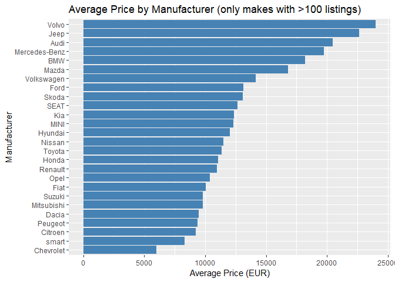

# Load necessary packages

    library(readr)
    library(dplyr)
    library(ggplot2)

# Load the CSV file in R dataframe and check rows and Columns

    cars <- read_csv("autoscout24-germany-dataset.csv", col_types = cols(
    .default = col_guess()
    ))
    glimpse(cars)

    ## Rows: 46,405
    ## Columns: 9
    ## $ mileage   <dbl> 235000, 92800, 149300, 96200, 156000, 147000, 91894, 127500, 115000, 104, 59580, 84000, 427000, 10…
    ## $ make      <chr> "BMW", "Volkswagen", "SEAT", "Renault", "Peugeot", "Toyota", "Renault", "Opel", "Mazda", "Ford", "…
    ## $ model     <chr> "316", "Golf", "Exeo", "Megane", "308", "Auris", "Scenic", "Zafira", "3", "Transit", "Meriva", "Go…
    ## $ fuel      <chr> "Diesel", "Gasoline", "Gasoline", "Gasoline", "Gasoline", "Electric/Gasoline", "Diesel", "Gasoline…
    ## $ gear      <chr> "Manual", "Manual", "Manual", "Manual", "Manual", "Automatic", "Manual", "Manual", "Automatic", "M…
    ## $ offerType <chr> "Used", "Used", "Used", "Used", "Used", "Used", "Used", "Used", "Used", "Used", "Used", "Used", "U…
    ## $ price     <dbl> 6800, 6877, 6900, 6950, 6950, 6950, 6970, 6972, 6980, 6990, 6990, 6990, 6990, 6990, 6999, 6999, 69…
    ## $ hp        <dbl> 116, 122, 160, 110, 156, 99, 131, 116, 150, 86, 101, 105, 204, 141, 120, 60, 150, 150, 135, 101, 8…
    ## $ year      <dbl> 2011, 2011, 2011, 2011, 2011, 2011, 2011, 2011, 2011, 2011, 2011, 2011, 2011, 2011, 2011, 2011, 20…

    cat("Rows:", nrow(cars), "Columns:", ncol(cars), "\n")

    ## Rows: 46405 Columns: 9

# Initial Inspection of the dataset

    head(cars)

    ## # A tibble: 6 × 9
    ##   mileage make       model  fuel              gear      offerType price    hp  year
    ##     <dbl> <chr>      <chr>  <chr>             <chr>     <chr>     <dbl> <dbl> <dbl>
    ## 1  235000 BMW        316    Diesel            Manual    Used       6800   116  2011
    ## 2   92800 Volkswagen Golf   Gasoline          Manual    Used       6877   122  2011
    ## 3  149300 SEAT       Exeo   Gasoline          Manual    Used       6900   160  2011
    ## 4   96200 Renault    Megane Gasoline          Manual    Used       6950   110  2011
    ## 5  156000 Peugeot    308    Gasoline          Manual    Used       6950   156  2011
    ## 6  147000 Toyota     Auris  Electric/Gasoline Automatic Used       6950    99  2011

    names(cars)

    ## [1] "mileage"   "make"      "model"     "fuel"      "gear"      "offerType" "price"     "hp"        "year"

    summary(cars)

    ##     mileage            make              model               fuel               gear            offerType        
    ##  Min.   :      0   Length:46405       Length:46405       Length:46405       Length:46405       Length:46405      
    ##  1st Qu.:  19800   Class :character   Class :character   Class :character   Class :character   Class :character  
    ##  Median :  60000   Mode  :character   Mode  :character   Mode  :character   Mode  :character   Mode  :character  
    ##  Mean   :  71178                                                                                                 
    ##  3rd Qu.: 105000                                                                                                 
    ##  Max.   :1111111                                                                                                 
    ##                                                                                                                  
    ##      price               hp           year     
    ##  Min.   :   1100   Min.   :  1   Min.   :2011  
    ##  1st Qu.:   7490   1st Qu.: 86   1st Qu.:2013  
    ##  Median :  10999   Median :116   Median :2016  
    ##  Mean   :  16572   Mean   :133   Mean   :2016  
    ##  3rd Qu.:  19490   3rd Qu.:150   3rd Qu.:2019  
    ##  Max.   :1199900   Max.   :850   Max.   :2021  
    ##                    NA's   :29

# Transforming columns to a standard.

    cars <- cars %>%
      mutate(
        mileage = as.numeric(mileage),
        hp = as.numeric(hp),
        price = as.numeric(price),
        year = as.integer(year)
      )

# Verify structure after transformation

    glimpse(cars)

    ## Rows: 46,405
    ## Columns: 9
    ## $ mileage   <dbl> 235000, 92800, 149300, 96200, 156000, 147000, 91894, 127500, 115000, 104, 59580, 84000, 427000, 10…
    ## $ make      <chr> "BMW", "Volkswagen", "SEAT", "Renault", "Peugeot", "Toyota", "Renault", "Opel", "Mazda", "Ford", "…
    ## $ model     <chr> "316", "Golf", "Exeo", "Megane", "308", "Auris", "Scenic", "Zafira", "3", "Transit", "Meriva", "Go…
    ## $ fuel      <chr> "Diesel", "Gasoline", "Gasoline", "Gasoline", "Gasoline", "Electric/Gasoline", "Diesel", "Gasoline…
    ## $ gear      <chr> "Manual", "Manual", "Manual", "Manual", "Manual", "Automatic", "Manual", "Manual", "Automatic", "M…
    ## $ offerType <chr> "Used", "Used", "Used", "Used", "Used", "Used", "Used", "Used", "Used", "Used", "Used", "Used", "U…
    ## $ price     <dbl> 6800, 6877, 6900, 6950, 6950, 6950, 6970, 6972, 6980, 6990, 6990, 6990, 6990, 6990, 6999, 6999, 69…
    ## $ hp        <dbl> 116, 122, 160, 110, 156, 99, 131, 116, 150, 86, 101, 105, 204, 141, 120, 60, 150, 150, 135, 101, 8…
    ## $ year      <int> 2011, 2011, 2011, 2011, 2011, 2011, 2011, 2011, 2011, 2011, 2011, 2011, 2011, 2011, 2011, 2011, 20…

# Data Cleaning

    library(dplyr)
    library(rlang)

    # make all column names lowercase (so offerType -> offertype etc.)
    names(cars) <- tolower(names(cars))

    # show current names to confirm
    cat("Columns in dataset:\n")

    ## Columns in dataset:

    print(names(cars))

    ## [1] "mileage"   "make"      "model"     "fuel"      "gear"      "offertype" "price"     "hp"        "year"

    # detect which column holds the manufacturer name (make / brand)
    make_col <- if ("make" %in% names(cars)) {
      "make"
    } else if ("brand" %in% names(cars)) {
      "brand"
    } else {
      stop("Neither 'make' nor 'brand' found in dataset column names.")
    }

    # Quick check of required numeric columns
    required_numeric <- c("price", "mileage", "year")
    missing_num <- setdiff(required_numeric, names(cars))
    if (length(missing_num) > 0) stop("Missing numeric columns: ", paste(missing_num, collapse = ", "))

    # Coerce types (safe conversions)
    cars <- cars %>%
      mutate(
        price = as.numeric(price),
        mileage = as.numeric(mileage),
        year = as.integer(year),
        hp = if ("hp" %in% names(cars)) as.numeric(hp) else NULL
      )

    # Count rows before cleaning
    n_before <- nrow(cars)
    cat("Rows before cleaning:", n_before, "\n")

    ## Rows before cleaning: 46405

    # Remove rows with missing essential values
    cars <- cars %>%
      filter(
        !is.na(price),
        !is.na(mileage),
        !is.na(year),
        !is.na(.data[[make_col]])
      )

    # Remove unrealistic values (tunable thresholds)
    cars <- cars %>%
      filter(
        price > 100,           # remove free / invalid listings
        price < 200000,        # reasonable upper bound (adjust if needed)
        mileage >= 0,
        mileage <= 500000,     # upper bound for mileage
        year >= 1980,          # sensible lower bound
        year <= as.integer(format(Sys.Date(), "%Y"))  # not in future
      )

    n_after_basic <- nrow(cars)
    cat("Rows after removing NAs & unrealistic values:", n_after_basic, 
        " (removed", n_before - n_after_basic, "rows )\n")

    ## Rows after removing NAs & unrealistic values: 46346  (removed 59 rows )

    # IQR outlier remover (applies to numeric vector)
    remove_outliers_logical <- function(x) {
      if (!is.numeric(x)) return(rep(TRUE, length(x)))
      q1 <- quantile(x, 0.25, na.rm = TRUE)
      q3 <- quantile(x, 0.75, na.rm = TRUE)
      iqr <- q3 - q1
      lower <- q1 - 1.5 * iqr
      upper <- q3 + 1.5 * iqr
      x >= lower & x <= upper
    }

    # Apply outlier removal for price and mileage
    keep_price <- remove_outliers_logical(cars$price)
    keep_mileage <- remove_outliers_logical(cars$mileage)

    # Combine filters and apply
    cars_clean <- cars %>%
      filter(keep_price & keep_mileage)

    n_after_outliers <- nrow(cars_clean)
    cat("Rows after IQR outlier removal:", n_after_outliers,
        " (removed", n_after_basic - n_after_outliers, "additional rows )\n")

    ## Rows after IQR outlier removal: 42313  (removed 4033 additional rows )

    # Summary of cleaned dataset
    cat("\nSummary of cleaned data:\n")

    ## 
    ## Summary of cleaned data:

    print(summary(select(cars_clean, price, mileage, year, hp)))

    ##      price          mileage            year            hp       
    ##  Min.   : 1100   Min.   :     0   Min.   :2011   Min.   :  1.0  
    ##  1st Qu.: 7390   1st Qu.: 22775   1st Qu.:2013   1st Qu.: 82.0  
    ##  Median :10700   Median : 62950   Median :2016   Median :110.0  
    ##  Mean   :13198   Mean   : 70373   Mean   :2016   Mean   :119.3  
    ##  3rd Qu.:16980   3rd Qu.:105700   3rd Qu.:2018   3rd Qu.:150.0  
    ##  Max.   :37460   Max.   :232564   Max.   :2021   Max.   :571.0  
    ##                                                  NA's   :26

    # Optional: show top makes remaining
    cat("\nTop makes (by count) in cleaned data:\n")

    ## 
    ## Top makes (by count) in cleaned data:

    print(cars_clean %>% count(.data[[make_col]]) %>% arrange(desc(n)) %>% head(10))

    ## # A tibble: 10 × 2
    ##    make              n
    ##    <chr>         <int>
    ##  1 Volkswagen     6355
    ##  2 Opel           4736
    ##  3 Ford           4270
    ##  4 Renault        2771
    ##  5 Skoda          2763
    ##  6 Audi           1978
    ##  7 BMW            1949
    ##  8 SEAT           1891
    ##  9 Hyundai        1827
    ## 10 Mercedes-Benz  1707

    # assign back to 'cars' if you want to continue using the same name
    cars <- cars_clean

    # 4.1 Price Distribution
    hist(cars$price,
         breaks = 50,
         main = "Distribution of Car Prices (Germany)",
         xlab = "Price (EUR)",
         col = "lightblue")

    # 4.2 Relationship between Price & Mileage
    ggplot(cars, aes(x = mileage, y = price)) +
      geom_point(alpha = 0.3, color = "darkblue") +
      scale_x_log10() + scale_y_log10() +
      labs(title = "Price vs Mileage (log-log scale)",
           x = "Mileage (km)",
           y = "Price (EUR)")

    ## Warning in scale_x_log10(): log-10 transformation introduced infinite values.

    # 4.3 Average Price by Manufacturer (Make)
    cars %>%
      group_by(make) %>%
      summarise(avg_price = mean(price, na.rm = TRUE),
                count = n()) %>%
      filter(count > 100) %>%
      ggplot(aes(x = reorder(make, avg_price), y = avg_price)) +
      geom_col(fill = "steelblue") +
      coord_flip() +
      labs(title = "Average Price by Manufacturer (only makes with >100 listings)",
           x = "Manufacturer",
           y = "Average Price (EUR)")

    # 5. Price by Registration Year
    ggplot(cars, aes(x = factor(year), y = price)) +
      geom_boxplot(fill = "lightgreen") +
      labs(title = "Price by Year of Manufacture",
           x = "Year",
           y = "Price (EUR)")

